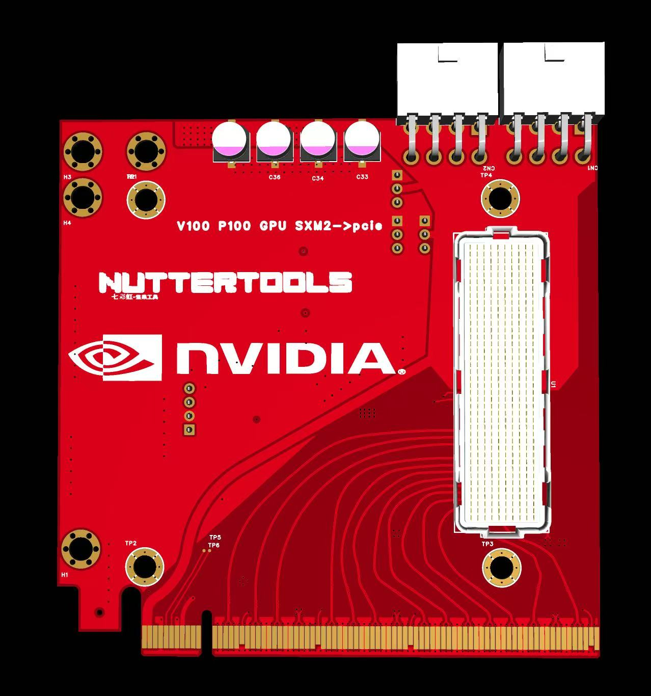
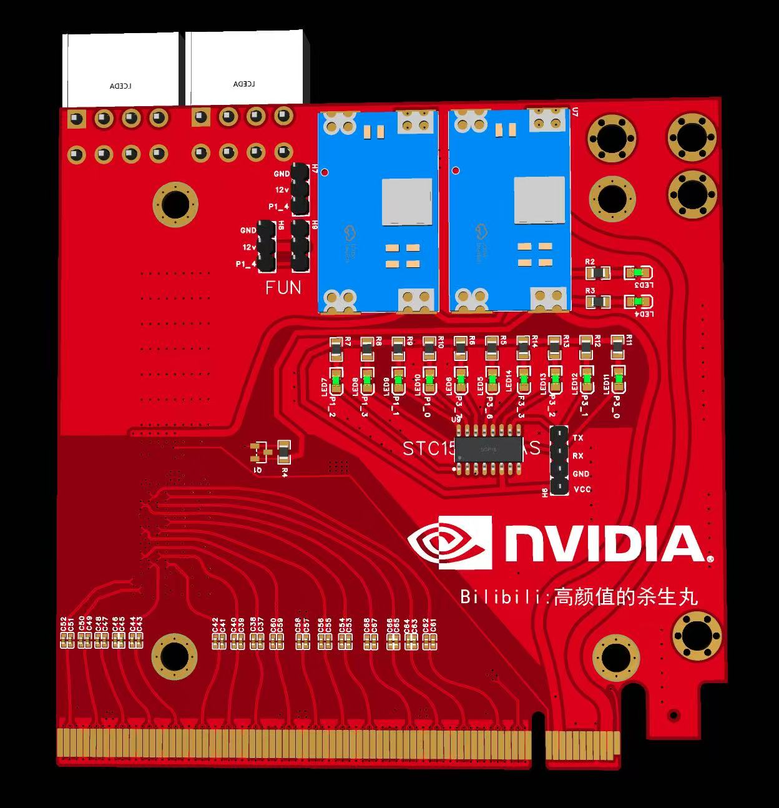
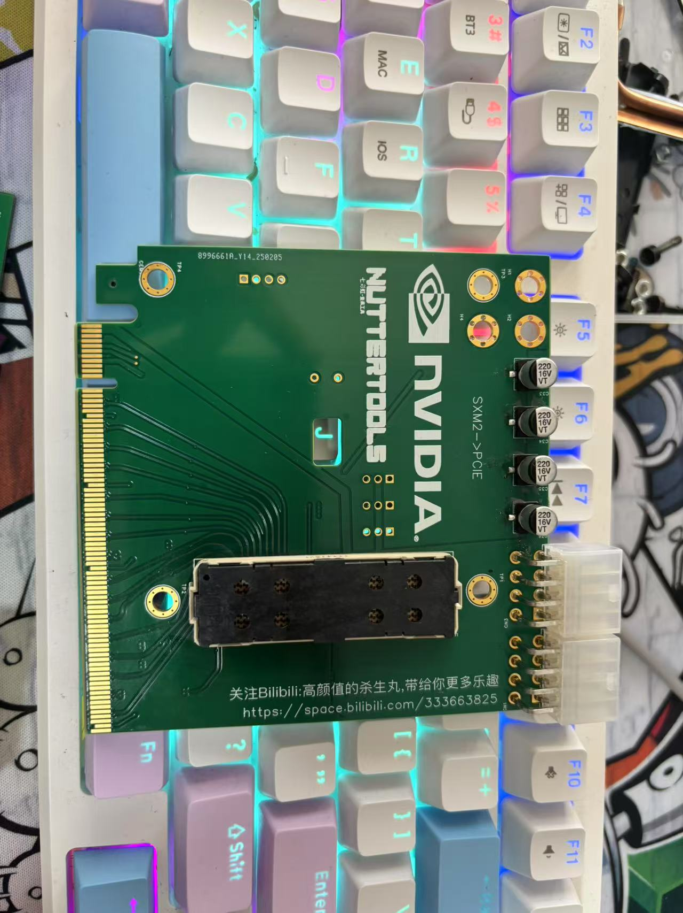
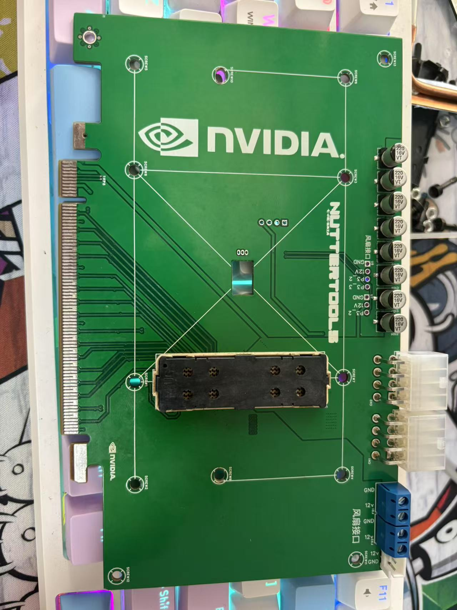
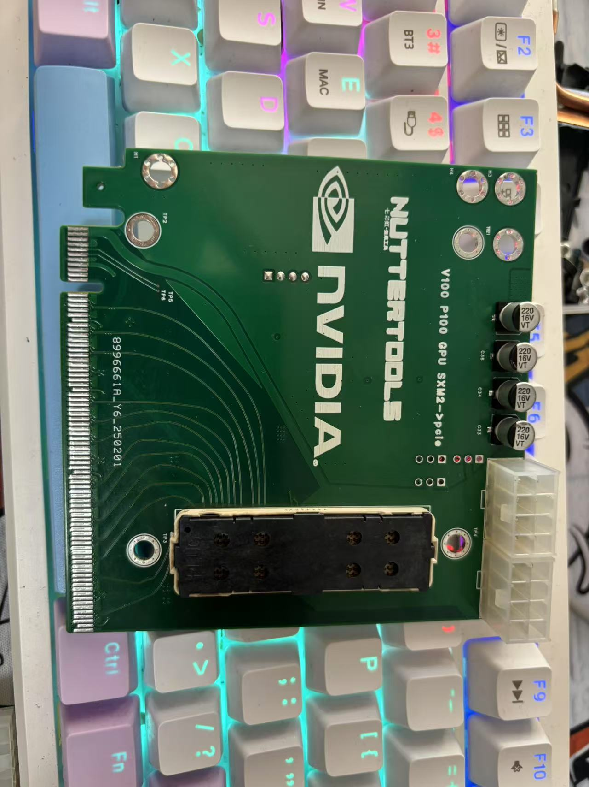
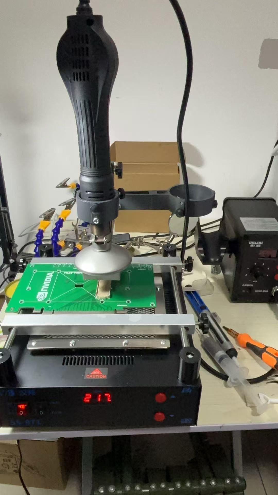
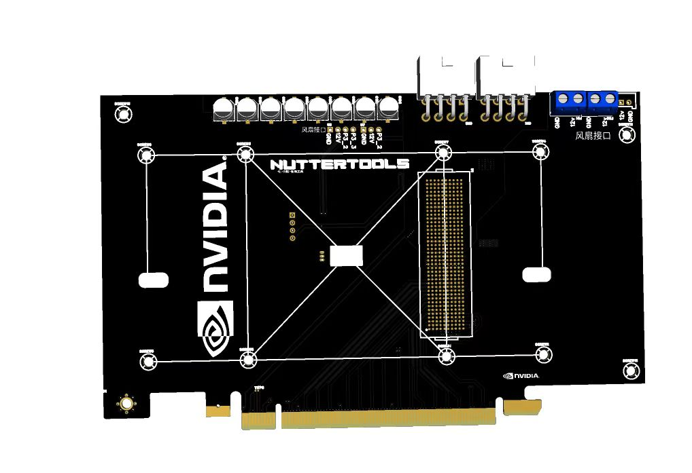
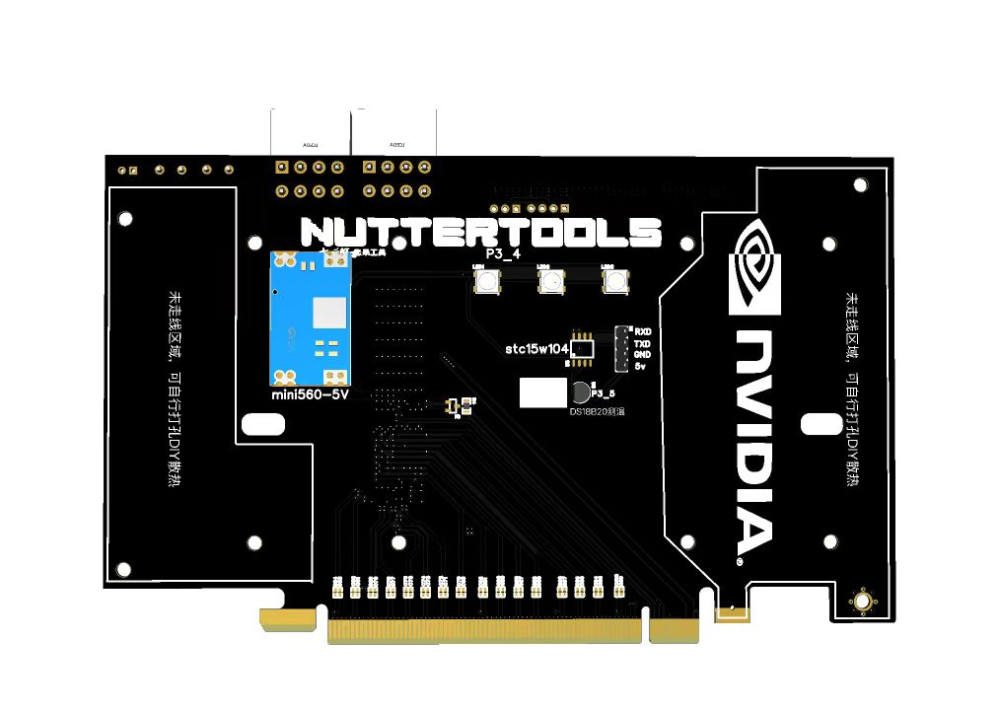
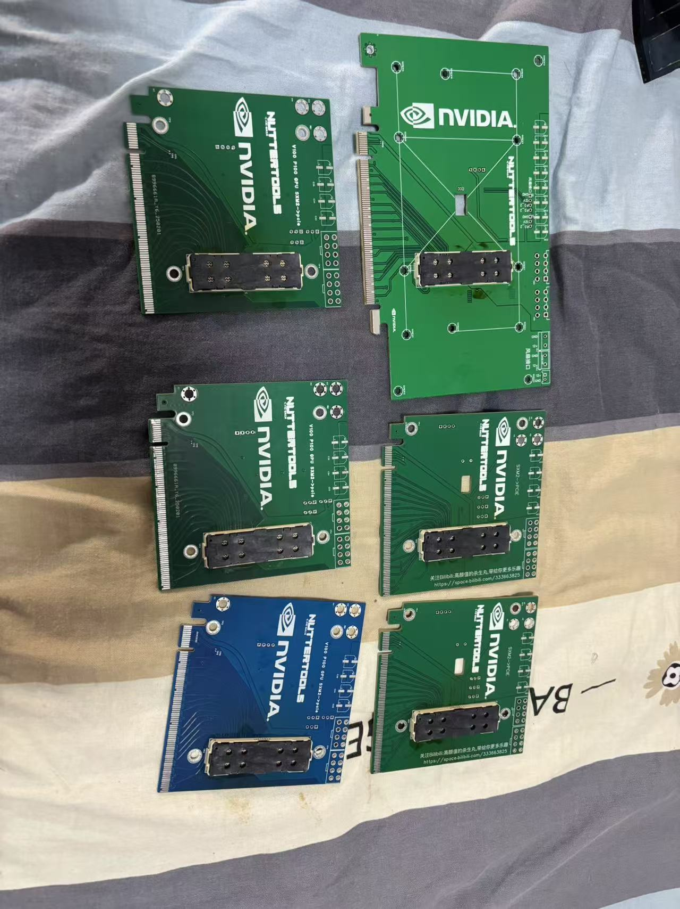
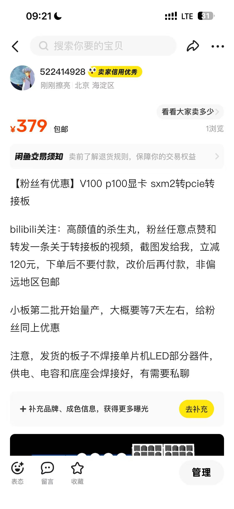

### SXM2 to PCIE adapter

#### 1.compatible with V100 and P100 GPU models
#### 2.stable operation on PCIE x16
#### 3.dual 8PIN power supply + PCIE interface power，can provide up to 375W of power
#### 4.uses the imported 84740-102LF interface, stable performance

#### 5.no NVLink, plug-and-play. 

#### This SXM2 to PCIE adapter comes in multiple versions, all of which operate stably. There are two smaller adapters, each measuring 10cm × 10cm, and one larger adapter, measuring 11cm × 18cm. One of the larger and one of the smaller adapters support the addition of a microcontroller for temperature reading, allowing fan speed control via PWM. The larger adapter also has pre-drilled holes for custom cooling modifications, such as installing an RTX 4090 heatsink or other cooling solutions.

### Available for purchase on the Xianyu platform in China or via private message here, 
### please contact me
- WeChat:13473465975.
- Gmail：xinyuuliu12378@gmail.com
- QQmail:522414928@qq.com
----

- image1

- image2

- image3

- image4

- image5

- image6

- image7

- image8

- image9

- image10

- Purchase Channels

