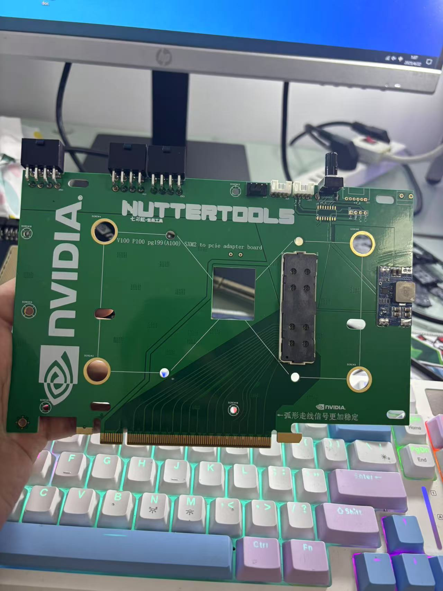
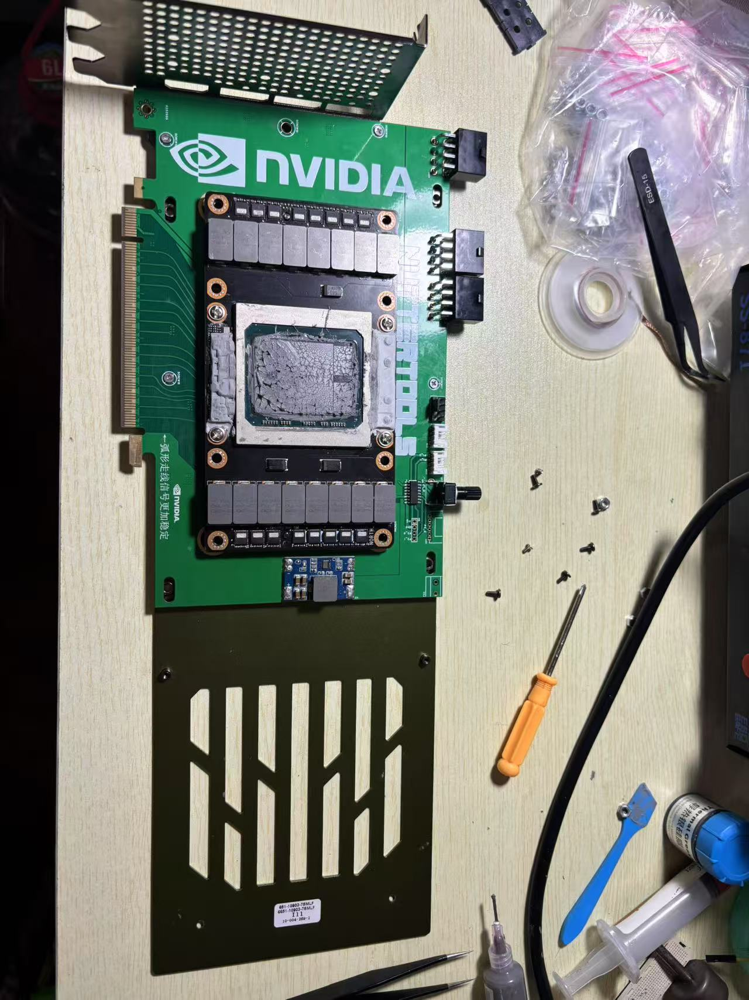
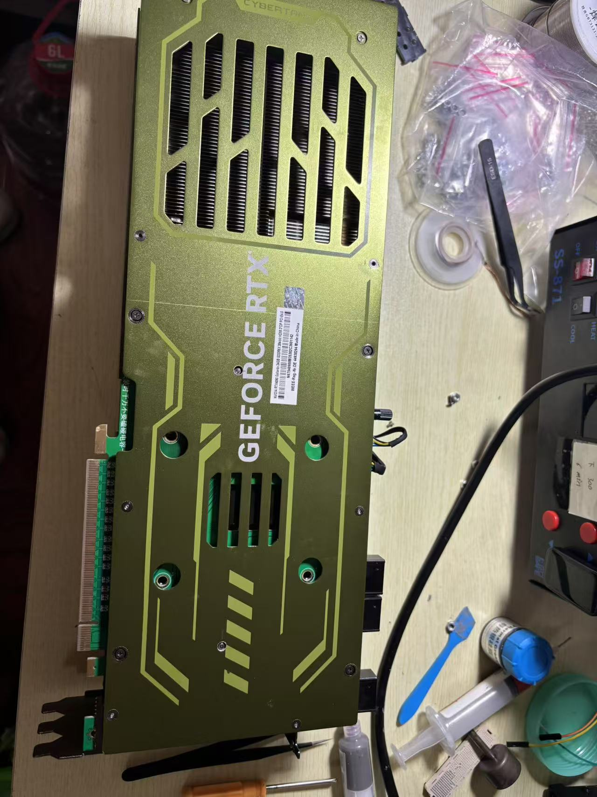

### SXM2 to PCIE adapter

#### 0.We prioritize the power supply capacity when the GPU is fully loaded. Therefore, we will upgrade the adapter board to **3×8-pin + PCIe power supply**, with a **theoretical rated power of 525W**.  

#### This will make it compatible with **PG199** graphics cards and provide greater reliability for **V100** and **P100**.

#### 1.compatible with V100 and P100 GPU models
#### 2.stable operation on PCIE x16
#### 3.dual 8PIN power supply + PCIE interface power，can provide up to 525W of power
#### 4.uses the imported 84740-102LF interface, stable performance

#### 5.no NVLink, plug-and-play. 

#### This SXM2 to PCIE adapter comes in multiple versions, all of which operate stably. There are two smaller adapters, each measuring 10cm × 10cm, and one larger adapter, measuring 13.3cm × 20cm. One of the larger and one of the smaller adapters support the addition of a microcontroller for temperature reading, allowing fan speed control via PWM. The larger adapter also has pre-drilled holes for custom cooling modifications, such as installing an RTX 4090 heatsink or other cooling solutions.

### Available for purchase on the Xianyu platform in China or via private message here, 
### please contact me
- WeChat:13473465975
- Gmail：xinyuuliu12378@gmail.com
- QQmail:522414928@qq.com
- bilibili：高颜值的杀生丸
- rednode：杀生丸的小作坊
----

## Large PCB
### Perfectly compatible with Manli RTX 4090 GPU cooler

- image1 

- image2

- image3

- image4

- image5

- image6

- image7

## Mini board
- image8

- image9

## 6-layer ENIG (Electroless Nickel Immersion Gold) process

- image10

- image11
